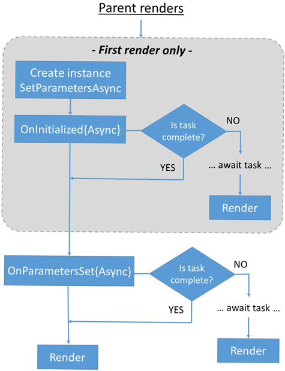

# WASM-Platzi

### Link de la página: https://jm-delivery.com/

### Tecnologías Usadas:


### Curso:
Este curso certifica mi aprendizaje del [Curso de Aplicaciones Web con Blazor WebAssembly y .NET](https://platzi.com/cursos/blazor-webassembly/) de la plataforma de cursos Platzi.
<p align="center">
    
</p>


Se puede descargar y ver el certificado en el siguiente [link](Images/diploma-blazor-webassembly.pdf)


## ¿Como funciona esta página?
Esta página aprovecha todos los recursos aprendidos en el curso, como por ejemplo los ***Componentes Compartidos***:

<p align="center">
    
    
    
</p>

</br>

Estos 3 componentes usan el Componente compartido [ModuleTitle](Shared/ModuleTitle.razor) en la carpeta Shared. <br>
Además usan un atributo `Color` el cual se inserta los estilos para colorear el `::before` del título.

## Products
La sección de Products es un CRUD que demuestra las habilidades adquiridas con BlazorWasm:

### Create 
En la sección de Products, hay un botón para agregar un nuevo Producto.
<p align="center">
    
</p>

Ese botón redirige a un formulario, hecho con el componente ***EditForm***:
<p align="center">
    
</p>

El botón guardar invoca al servicio `ProductService`, el cual se encarga de hacer la petición y guardar el producto en la api, luego, con la clase `NavigationManager` se redirige a la sección de productos nuevamente.

[AddProduct.razor](Pages/AddProduct.razor)
```c#
    private async Task Save()
    {
        newProduct.Images = new string[1] { newProduct.Image };
        await productService.Add(newProduct);
        navigationManager.NavigateTo("/products");
    }
```

### Read
Para traer todos los productos de la API, se usa el método `GetProductsAsync()` del servicio `ProductService` y se agregan en la lista vacía `products`:

[FetchProducts.razor](Pages/FetchProducts.razor)
```c#
    CultureInfo provider = new CultureInfo("en-us");
    private List<Product> products = new List<Product>{ };

    protected override async Task OnInitializedAsync()
    {
        await ReloadProds();
    }

    private async Task ReloadProds()
    {
        products.Clear();
        var newProds = await GetProducts();
        products.AddRange(newProds);
    }

    private async Task<List<Product>> GetProducts()
    {        
        return await productService.GetProductsAsync();
    }   
```

El método `ReloadProds()` vacía la lista y vuelve a hacer la petición para volver a llenar la lista, es el método que se llama en la primera llamada a la página.

Una vez con la lista llena, se mapea con ciclo `foreach`:

```c#
@foreach (Product product in products)
{
    <div class="card-container">   
        <div class="card">
            
            <div class="card-body">
                <h5><b>@product.Title</b></h5>
                <p>@product.Price.ToString("C", provider)</p>
                <NavLink href="@($"editproduct/{product.Id}")">
                    <button title="edit" class="btn btn-primary">
                        <span class="oi oi-pencil"></span>
                    </button>
                </NavLink>
                
                <button title="Delete" class="btn btn-danger btn-delete" @onclick="@(() => DeleteProduct(product))">
                    <span class="oi oi-trash"></span>
                </button>
                <p>From: @product.Category.Name</p>
            </div> 
        </div>
    </div>
}
```

### Update
Cada Producto tiene un botón para editarlo:
<p align="center">
    
</p>

Este botón redirige mediante un `NavLink` a una página para editar el producto, donde se le envía el id del producto mediante la url.

En esta página, utilicé los [***Life cycles***](https://learn.microsoft.com/en-us/aspnet/core/blazor/components/lifecycle?view=aspnetcore-8.0) para obtener el id del parametro de la URL:
<p align="center">
    
</p>

El parámetro se recibe en la variable `productId`, y se inicializa en la función `SetParametersAsync`:

[EditProduct.razor](Pages/EditProduct.razor)
```c#
    private Product newProduct = new();

    [Parameter]
    public string productId { get;set; }
    private List<Category> categories = new List<Category>();

    public override async Task SetParametersAsync(ParameterView parameters)
    {
        if (parameters.TryGetValue<string>("productId", out var value))
        {
            if (value is not null)
            {
                productId = value;
            }   
        }

        await base.SetParametersAsync(parameters);
    }
```

Luego, en la función `OnInitializedAsync` se hace uso del servicio `ProductService` para extraer de la API el producto y sus atributos:

```c#
    protected override async Task OnInitializedAsync()
    {
        Product dbProduct = await productService.GetProductByIdAsync(productId);

        newProduct = dbProduct;
        newProduct.Image = dbProduct.Images[0];
        newProduct.CategoryId = dbProduct.Category.Id;
        categories = await categoryService.Get();
    }
```

Una vez la variable se haya inicializado con sus atributos, es recibido en el formulario para ser editado:
<p align="center">
    
</p>

Finalmente, el botón **Save** invoca una función que usa el servicio `ProductService` para guardar los cambios del producto:

```c#
private async Task Save()
{
    newProduct.Images = new string[1] { newProduct.Image };
    await productService.Update(productId, newProduct);
    navigationManager.NavigateTo("/products");
}
```

### Delete
Cada producto tiene un botón para borrarlo:
<p align="center">
    
</p>

Este botón invoca una función de JavaScript que viene en el servicio `JSRuntime`, el cual nos permite invocar funciones de JavaScript en .NET:

[FetchProducts.razor](Pages/FetchProducts.razor)
```C#
<button 
    title="Delete" 
    class="btn btn-danger btn-delete" 
    @onclick="@(() => DeleteProduct(product))">
    <span class="oi oi-trash"></span>
</button>
```

```C#
private async Task DeleteProduct(Product product)
{
    if (!await JSRuntime.InvokeAsync<bool>("confirm", $"Estás seguro que quieres borrar {product.Title}?" ))
        return;
    
    await productService.Delete(product.Id);
    toastService.ShowSuccess("Producto eliminado correctamente");
    await ReloadProds();
}
```

La función le consulta al usuario si está seguro de borrar el producto seleccionado:
<p align="center">
    
</p>

Luego de ser borrado el producto, se implementa la librería [**Blazored Toast**](https://github.com/Blazored/Toast) par mostrar un mensaje en pantalla para informar al usuario que el producto ha sido borrado correctamente:
<p align="center">
    
</p>

